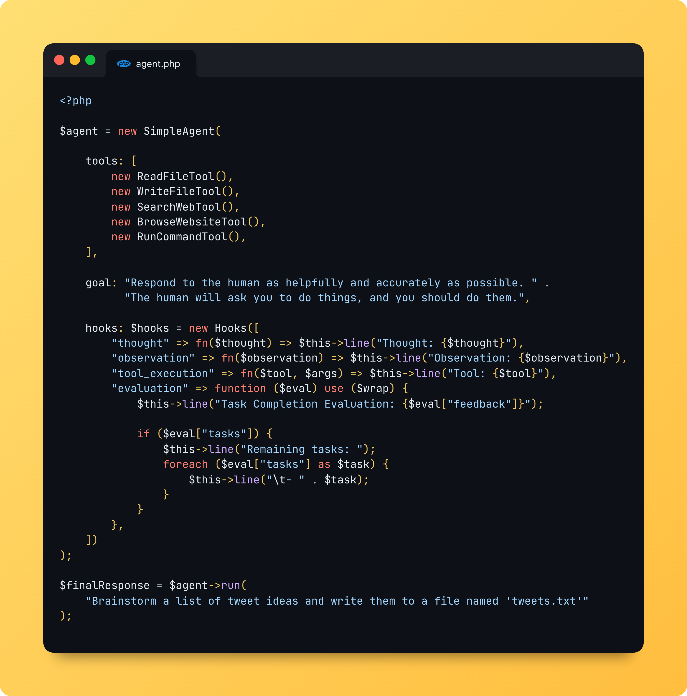
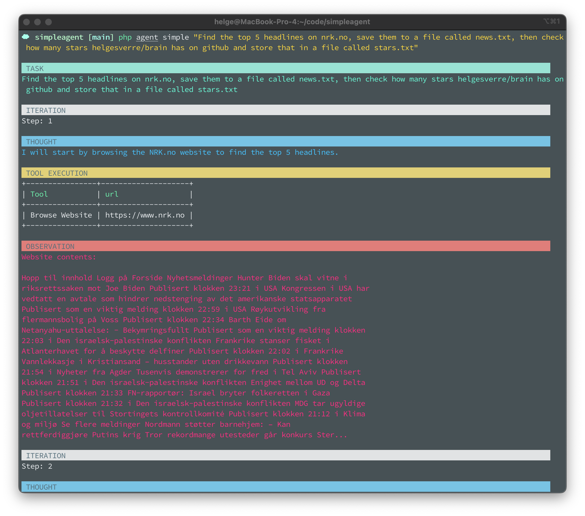

<p align="center"></p>

# Agent - Library for building AI agents in PHP

[](https://packagist.org/packages/helgesverre/agent)
[](https://packagist.org/packages/helgesverre/agent)

Proof of concept AI Agent using the [Brain](https://github.com/helgesverre/brain) package.

## See it in action.

<a href="https://share.cleanshot.com/kTZXyFnY"></a>

Video Link: https://share.cleanshot.com/kTZXyFnY

## Installation

Install it via composer:

```bash
composer require helgesverre/agent
```

## TODO:

- Add more tests for the agent class
- Add database tool (sqlite)
- Trello tool
- Google Keep tool
- Google Calendar Tool
- trim the interaction history to a max length so we dont overflow the context length.
- Implement "crew" feature (multiple agents)
    - Delegate task to other agent
    - Ask other agent for help


- Vector database integration (swappable?)
    - https://turbopuffer.com/
    - Qdrant
    - Chroma
    - Milvus

## Ideas:

- Investigate embedding [Smol Developer](https://github.com/smol-ai/developer) as a tool
- Implement a "memory" feature, so the agent can remember
  things. [AgentMemory](https://github.com/autonomousresearchgroup/agentmemory)
- Implement an API that follows the [Agent Protocol](https://agentprotocol.ai/) (or make up something similar)
- Separate out the "agent" library code, then build a gui on top of it. (Electron, NativePHP, Livewire with regular web
  server?)
- Figure out if streaming is a pain in the ass to implement using generators
- Integrate [Aider](https://aider.chat) via Docker as a runnable
  tool [see](https://aider.chat/docs/faq.html#can-i-script-aider)
