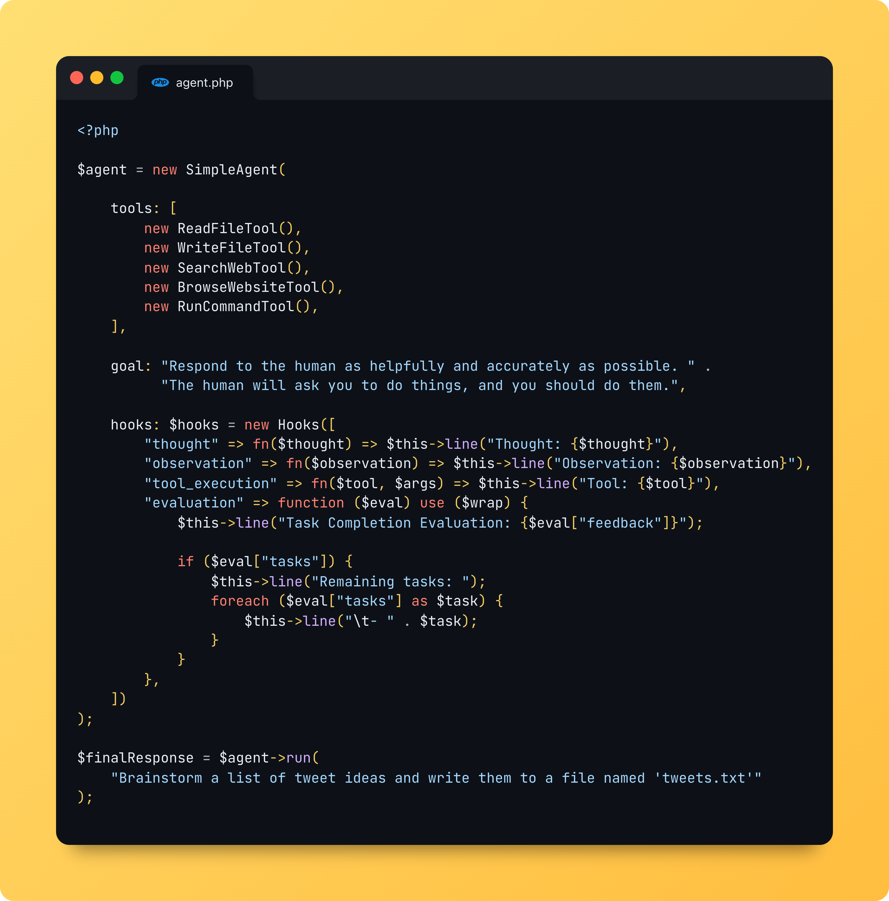
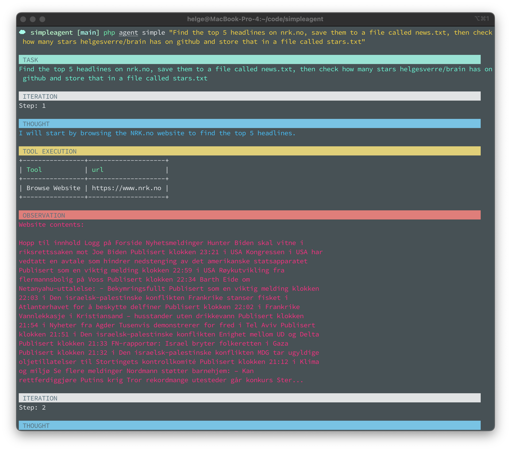

<p align="center"></p>

# Agent - AI Agent Framework for PHP

[](https://packagist.org/packages/helgesverre/agent)
[](https://packagist.org/packages/helgesverre/agent)
[](https://github.com/helgesverre/agent/blob/main/LICENSE.md)

A Laravel Zero-based CLI application for building and running AI agents with tool calling capabilities using OpenAI's
function calling API.

> Note: This is mostly meant as a playground for my own experimentation, don't use this for anything serious, i will
> likely break your shit eventually.

## See it in action

<a href="https://share.cleanshot.com/kTZXyFnY"></a>

Video Link: https://share.cleanshot.com/kTZXyFnY

## Installation

Clone the repository and install dependencies:

```bash
git clone https://github.com/helgesverre/agent.git
cd agent
composer install
```

## Configuration

Set your API keys in your `.env` file:

```env
OPENAI_API_KEY=your-api-key-here
BRAVE_API_KEY=your-brave-search-api-key  # Optional, for web search functionality
```

## Key Features

- **Function Calling**: Native OpenAI function calling API integration
- **Error Recovery**: Graceful handling of failures with automatic retries
- **Enhanced Prompting**: Markdown-based prompts for better model comprehension
- **Context Management**: Automatic conversation history tracking
- **Session Persistence**: Save and resume agent tasks across runs
- **Parallel Tool Execution**: Execute independent tools simultaneously (opt-in with --parallel flag)
- **Minimal Terminal Display**: Clean, colored symbol-based output
- **Hook System**: Monitor and customize agent behavior in real-time
- **Built-in Tools**: Web search, website browsing, file I/O, and command execution
- **PHP Attributes**: Clean tool creation with `#[AsTool]` attributes

## Quick Start Guide

### Running the Agent CLI

```bash
# Run with a task
php agent run "Write a hello world message to a file"

# Interactive mode - will prompt for task
php agent run

# Enable text-to-speech for the final answer (macOS only)
php agent run "What is the weather today?" --speak

# Save session with custom ID
php agent run "Complex research task" --save-session=research-project

# Save session with auto-generated ID
php agent run "Analyze codebase" --save-session=1

# Resume a saved session
php agent run --resume=research-project

# Enable parallel tool execution (opt-in)
php agent run "Search for 'PHP' and 'Laravel' simultaneously" --parallel

# Parallel execution with environment variable
AGENT_PARALLEL_ENABLED=true php agent run "Read multiple files at the same time"
```

### More Examples

```bash
# Search for information
php agent run "Find the latest PHP 8.3 features and summarize them"

# File operations
php agent run "Create a markdown file with today's date and a todo list template"

# Web research
php agent run "Search for the top 3 PHP frameworks in 2024 and compare them"

# System information
php agent run "Check the current PHP version and list installed extensions"

# Parallel operations (requires --parallel flag)
php agent run "Search for 'testing tools' and 'PHP frameworks' at the same time" --parallel
php agent run "Read README.md and CHANGELOG.md simultaneously" --parallel
```

### Basic Agent Usage

```php
use App\Agent\Agent;
use App\Agent\Hooks;
use App\Tools\ReadFileTool;
use App\Tools\WriteFileTool;
use App\Tools\RunCommandTool;

// Create hooks for monitoring agent activity
$hooks = new Hooks();
$hooks->on('action', function($action) {
    echo "Executing: {$action['action']} with " . json_encode($action['action_input']) . "\n";
});
$hooks->on('observation', function($observation) {
    echo "Result: $observation\n";
});

// Initialize the agent with tools
$agent = new Agent(
    tools: [
        new ReadFileTool(),  // Reads from 'output' directory by default
        new WriteFileTool('./output'),
        new RunCommandTool(),
    ],
    goal: 'Help the user accomplish their task',
    hooks: $hooks,
    maxIterations: 10  // Prevent infinite loops
);

// Run the agent with a task
$result = $agent->run('Write a hello world message to a file called hello.txt');
echo "Final result: $result\n";
```

### CLI Output

The agent uses a minimal display with colored symbols:

- ◆ Task announcement (cyan)
- ◈ Agent thoughts (blue)
- ⬡ Web search (blue hexagon)
- ⬢ Browse website (green hexagon)
- ⬣ Read file (yellow hexagon)
- ⬤ Write file (magenta circle)
- ⬥ Run command (cyan diamond)
- ⟐ Parallel execution (magenta parallel lines)
- ◉ Task evaluation (green circle)
- ✓ Final answer (green checkmark)
- [✓] Successful parallel tool (green)
- [✗] Failed parallel tool (red)

Example output:

```
◆ Task: find a simple recipe for pasta

⬡ search_web
  └─ [...results...]
⬢ browse_website www.example.com
◉ The user requested a simple pasta recipe...

✓ Answer: Here's a simple pasta recipe...
```

## Creating Custom Tools

Tools are the building blocks of agent capabilities. Here's how to create a custom tool:

### Important: Tool Naming Requirements

- Tool names must match the pattern `^[a-zA-Z0-9_-]+$`
- Use underscores or hyphens instead of spaces
- Examples: `get_weather`, `search_web`, `read-file`

```php
use App\Agent\Tool\Attributes\AsTool;
use App\Agent\Tool\Attributes\Description;
use App\Agent\Tool\Tool;

#[AsTool(
    name: 'get_weather',  // REQUIRED: Use underscores, no spaces!
    description: 'Get the current weather for a location'
)]
class WeatherTool extends Tool
{

    public function run(
        #[Description('The city to get weather for')]
        string $city,
        
        #[Description('The country code (optional)')]
        ?string $country = null
    ): string {
        // Implementation to fetch weather data
        $location = $country ? "$city, $country" : $city;
        
        // Call weather API...
        $weatherData = $this->fetchWeatherData($location);
        
        return "The current weather in $location is: " . $weatherData;
    }
    
    private function fetchWeatherData(string $location): string {
        // Actual API implementation...
        return "sunny, 25°C";
    }
}
```

### Example: Adding a Database Query Tool

```php
#[AsTool(
    name: 'query_database',
    description: 'Execute safe read-only database queries'
)]
class DatabaseQueryTool extends Tool
{
    
    public function run(
        #[Description('The SQL query to execute (SELECT only)')]
        string $query
    ): string {
        // Validate it's a SELECT query
        if (!str_starts_with(strtoupper(trim($query)), 'SELECT')) {
            return "Error: Only SELECT queries are allowed";
        }
        
        // Execute query...
        return json_encode($results);
    }
}
```

## Function Calling

The function calling system uses OpenAI's function calling feature to interact with tools:

```php
use App\Agent\Agent;
use App\Agent\LLM;
use App\Agent\FunctionCallBuilder;

// The Agent class automatically prepares tool schemas:
class Agent
{
    protected function prepareToolsSchema(): void
    {
        foreach ($this->tools as $tool) {
            $parameters = [];
            
            foreach ($tool->arguments() as $arg) {
                $parameters[$arg->name] = [
                    'type' => $this->mapPhpTypeToJsonSchema($arg->type),
                    'description' => $arg->description ?? '',
                ];
            }
            
            $this->toolsSchema[] = [
                'name' => $tool->name(),
                'description' => $tool->description(),
                'parameters' => [
                    'type' => 'object',
                    'properties' => $parameters,
                    'required' => array_values(array_map(
                        fn($arg) => $arg->name,
                        array_filter($tool->arguments(), fn($arg) => !$arg->nullable)
                    )),
                ],
            ];
        }
    }
}

// The LLM class provides a function calling interface:
$result = LLM::functionCall([
    'functions' => $toolsSchema,
    'final_answer' => [...]
])->get($prompt);
```

## Error Handling

The agent includes built-in error handling:

```php
use App\Agent\Agent;
use App\Agent\Hooks;

$hooks = new Hooks();

// Monitor errors through hooks
$hooks->on('observation', function($observation) {
    if (str_contains($observation, 'error:')) {
        error_log("Agent encountered error: $observation");
    }
});

$agent = new Agent(
    tools: [...],
    hooks: $hooks
);

// The agent will automatically:
// - Handle API errors gracefully
// - Retry failed tool executions
// - Provide error feedback in observations
// - Continue trying alternative approaches
```

## Context Management

The context management system helps track conversation history:

```php
use App\Agent\Agent;
use App\Agent\ContextManager;
use App\Agent\Hooks;

$hooks = new Hooks();

// The Agent class automatically manages intermediate steps
$agent = new Agent(
    tools: [...],
    goal: 'Help with tasks',
    hooks: $hooks
);

// The agent tracks steps internally:
// - Thoughts
// - Actions taken
// - Tool executions
// - Observations

// Context is automatically trimmed to last 5 steps to manage token usage
```

## Hooks System

The hooks system allows monitoring and customizing agent behavior:

```php
use App\Agent\Hooks;

$hooks = new Hooks();

// Listen for specific events
$hooks->on('thought', function($thought) {
    echo "Agent is thinking: $thought\n";
});

$hooks->on('tool_execution', function($toolName, $args) {
    echo "Executing $toolName with: " . json_encode($args) . "\n";
});

// Available hook events:
// - 'start': When task begins
// - 'iteration': New step number
// - 'thought': Agent reasoning
// - 'action': Tool execution
// - 'observation': Tool results
// - 'evaluation': Progress check
// - 'final_answer': Task complete
```

## Task Evaluation

The agent evaluates task completion before providing final answers:

```php
use App\Agent\Agent;
use App\Agent\Hooks;

$hooks = new Hooks();
$hooks->on('evaluation', function($eval) {
    if ($eval) {
        echo "Task evaluation: " . ($eval['feedback'] ?? 'No feedback') . "\n";
        if (isset($eval['status'])) {
            echo "Status: " . $eval['status'] . "\n";
        }
    }
});

$agent = new Agent(
    tools: [...],
    goal: 'Complete tasks thoroughly',
    hooks: $hooks,
);

// The agent will:
// 1. Execute tools to work on the task
// 2. Evaluate if the task is complete
// 3. Provide a final answer only when satisfied
$result = $agent->run('Create a summary of recent tech news');
```

## Session Persistence

The agent supports saving and resuming tasks across runs, allowing you to:
- Interrupt long-running tasks and resume them later
- Share agent sessions between team members
- Debug agent behavior by inspecting saved states
- Build task history and audit trails

### Saving Sessions

```bash
# Save with custom session ID
php agent run "Research PHP frameworks" --save-session=php-research

# Save with auto-generated ID (based on task and timestamp)
php agent run "Analyze codebase" --save-session=1
```

### Resuming Sessions

```bash
# Resume a previously saved session
php agent run --resume=php-research

# The agent will continue from where it left off,
# maintaining all context and previous steps
```

### Session Storage

Sessions are stored as JSON files in `storage/agent-sessions/`:
- Each session includes the task, steps taken, and current state
- Files are human-readable for debugging
- Sessions persist across system restarts

### Programmatic Usage

```php
use App\Agent\Agent;

// Enable session saving
$agent = new Agent($tools, $goal, $maxIterations, $hooks);
$agent->enableSession('my-session-id');

// Resume from session
$agent = Agent::fromSession('my-session-id', $tools, $hooks);
if ($agent) {
    $result = $agent->run('Continue previous task');
}
```

## Parallel Tool Execution

The agent supports executing multiple independent tools simultaneously for improved performance. This feature is opt-in to maintain backward compatibility.

### Enabling Parallel Execution

```bash
# Use the --parallel flag
php agent run "Search for 'PHP testing' and 'Laravel testing' simultaneously" --parallel

# Or use environment variable
AGENT_PARALLEL_ENABLED=true php agent run "Read multiple files at the same time"
```

### How It Works

- The agent detects parallel opportunities from keywords like "simultaneously", "at the same time", "both X and Y"
- Tools are executed in isolated processes (up to 4 concurrent)
- Results are collected and presented together
- Failed tools are tracked to prevent re-execution loops

### Configuration

```php
// config/app.php
'parallel_execution' => [
    'enabled' => env('AGENT_PARALLEL_ENABLED', false),
    'max_processes' => env('AGENT_MAX_PARALLEL', 4),
    'timeout' => env('AGENT_TOOL_TIMEOUT', 30),
],
```

### Programmatic Usage

```php
$agent = new Agent(
    tools: $tools,
    goal: $goal,
    maxIterations: 20,
    hooks: $hooks,
    parallelEnabled: true  // Enable parallel execution
);
```

### Visual Output

When tools execute in parallel, you'll see:
- ⟐ Cyan indicators for queuing and parallel operations
- [✓] Green checkmarks for successful tool execution
- [✗] Red X marks for failed tool execution
- Clear summaries of what was executed and the results

## Available Tools

The framework includes several built-in tools:

- **SearchWebTool** (`search_web`): Search the web for information using Brave Search API
- **BrowseWebsiteTool** (`browse_website`): Extract text content from websites
- **ReadFileTool** (`read_file`): Read file contents from the output directory
- **WriteFileTool** (`write_file`): Create or update files in the output directory
- **RunCommandTool** (`run_command`): Execute system commands safely
- **SpeakTool** (`speak`): Text-to-speech output (macOS only)

## Advanced Configuration

### Customizing Prompt Templates

You can extend the `Prompt` class to customize how prompts are generated:

```php
use App\Agent\Prompt;

class CustomPrompt extends Prompt
{
    public function decideNextStep(): string
    {
        return $this->combine([
            "# Custom Agent Framework",
            "## Task Definition",
            $this->task,
            // Additional custom sections...
            $this->prepareTools(),
            $this->prepareContext(),
        ]);
    }
}

// To use a custom prompt, you would need to extend the Agent class
// and override the decideNextStep method to use your custom prompt
```

### Model Configuration

The agent uses OpenAI's API. You can configure the model by setting the constant in `App\Agent\LLM`:

```php
// In App\Agent\LLM
const model = 'gpt-4o-mini'; // Default model
```

### FunctionCallBuilder

The `FunctionCallBuilder` class handles the interaction with OpenAI's function calling API:

```php
use App\Agent\LLM;

// The Agent class automatically uses function calling:
$result = LLM::functionCall($tools)->get($prompt);

// Result structure:
// [
//     'function_call' => [
//         'name' => 'tool_name',
//         'arguments' => [...]
//     ],
//     'thought' => 'reasoning...'
// ]
```

### Testing

The project includes comprehensive tests:

```bash
# Run all tests
composer test

# Run specific test suite
composer test -- --filter=AgentTest
```

## Limitations

- Cannot modify files outside the designated output directory
- Web browsing extracts text only (no JavaScript execution)
- Command execution is sandboxed for safety
- Context window limits long conversations

## License

This package is open-sourced software licensed under the [MIT license](LICENSE.md).
