# Agent Framework - Architecture Diagrams

## System Overview

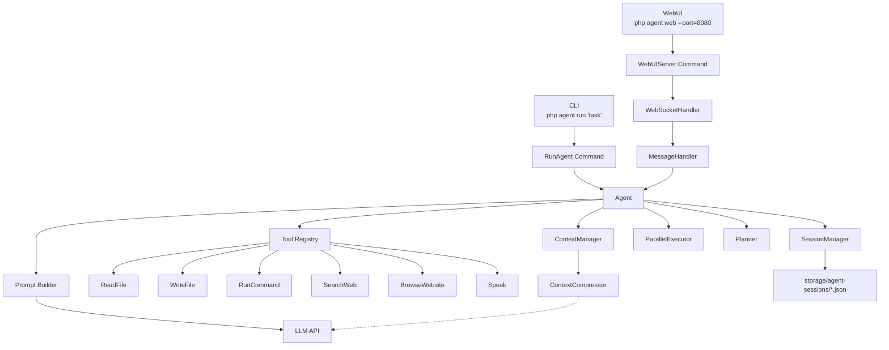

---

## Agent Main Loop

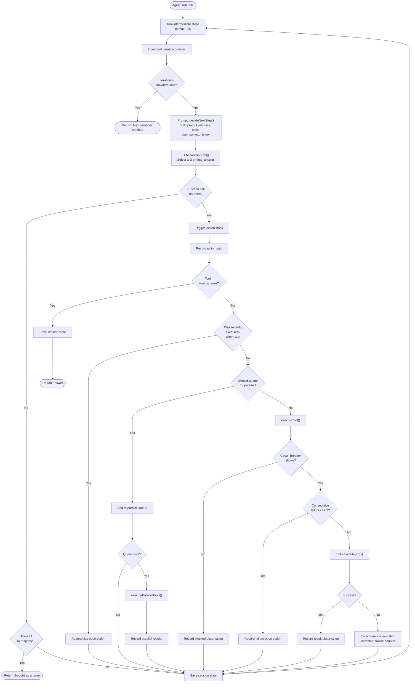

---

## Tool Execution

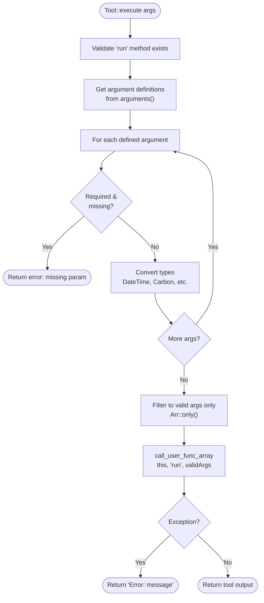

---

## Planning Flow

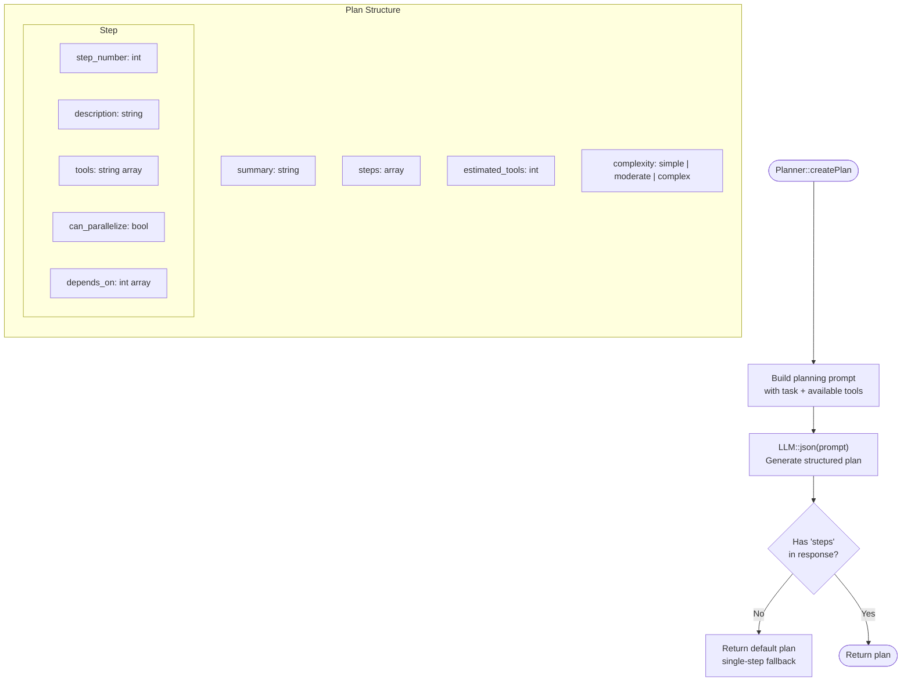

---

## Prompt Construction

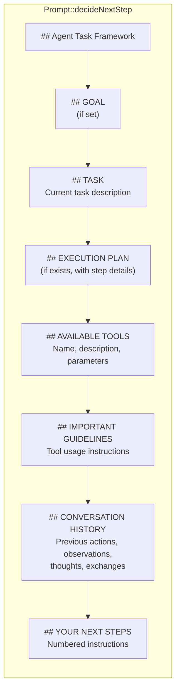

---

## Context Management

```mermaid
flowchart TD
    Start([ContextManager::manageContext]) --> Enabled{Compression<br/>enabled?}
    Enabled -- No --> Return([Return steps unchanged])
    Enabled -- Yes --> ShouldCompress{shouldCompress()?}
    ShouldCompress -- No --> Return
    ShouldCompress -- Yes --> Compress["performIntelligentCompression()"]
    Compress --> StillOver{Still over<br/>step limit?}
    StillOver -- No --> Return2([Return compressed steps])
    StillOver -- Yes --> T1

    subgraph Trim["intelligentTrim()"]
        direction TB
        T1["Score each step by importance"]
        T2["Persistent ops: 100 pts<br/>Final answer: 75 pts<br/>Recent steps: 50 pts<br/>Observations: 30 pts<br/>Thoughts: 25 pts"]
        T3["Sort by score descending"]
        T4["Keep top N steps<br/>up to maxSteps limit"]
        T1 --> T2 --> T3 --> T4
    end

    T4 --> Return3([Return trimmed steps])
```

### Context Compression Strategy

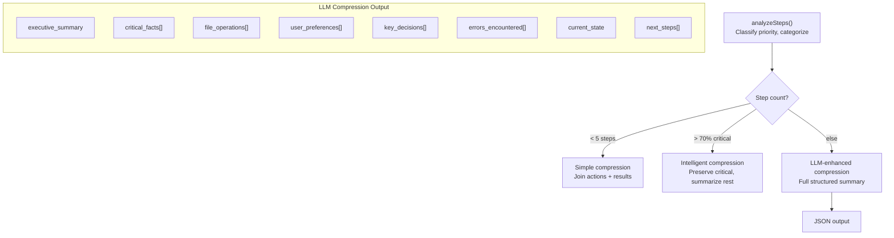

---

## Session Management

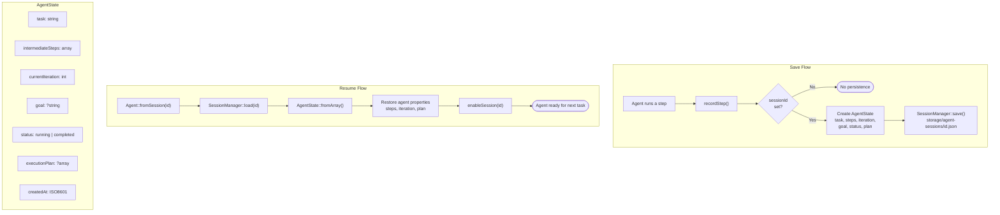

---

## Parallel Execution

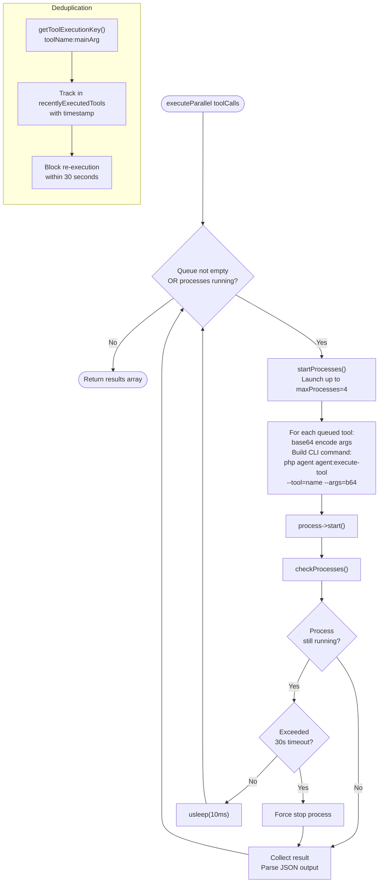

---

## Chat Mode

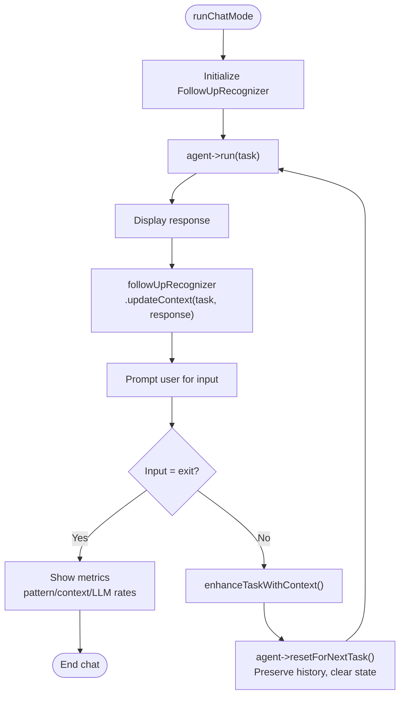

### Follow-Up Recognition (3-Layer System)

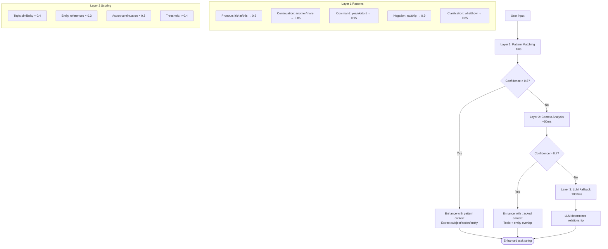

---

## WebUI Architecture

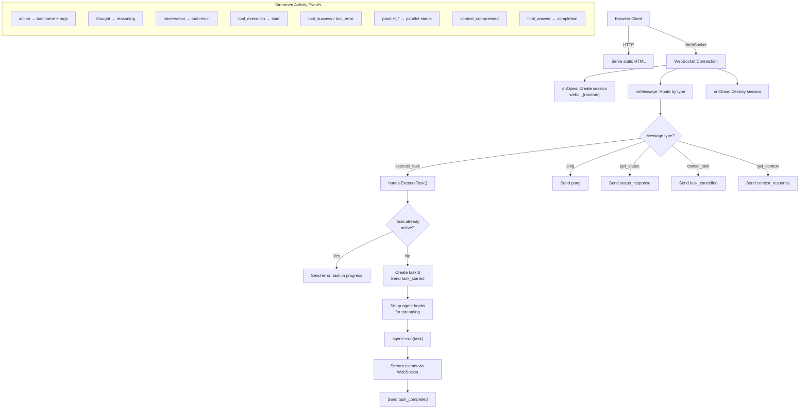

---

## CLI Entry Points

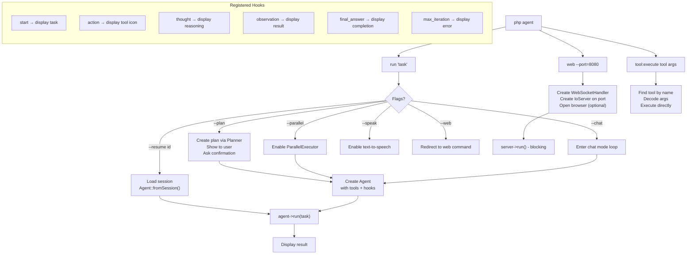

---

## Circuit Breaker Pattern

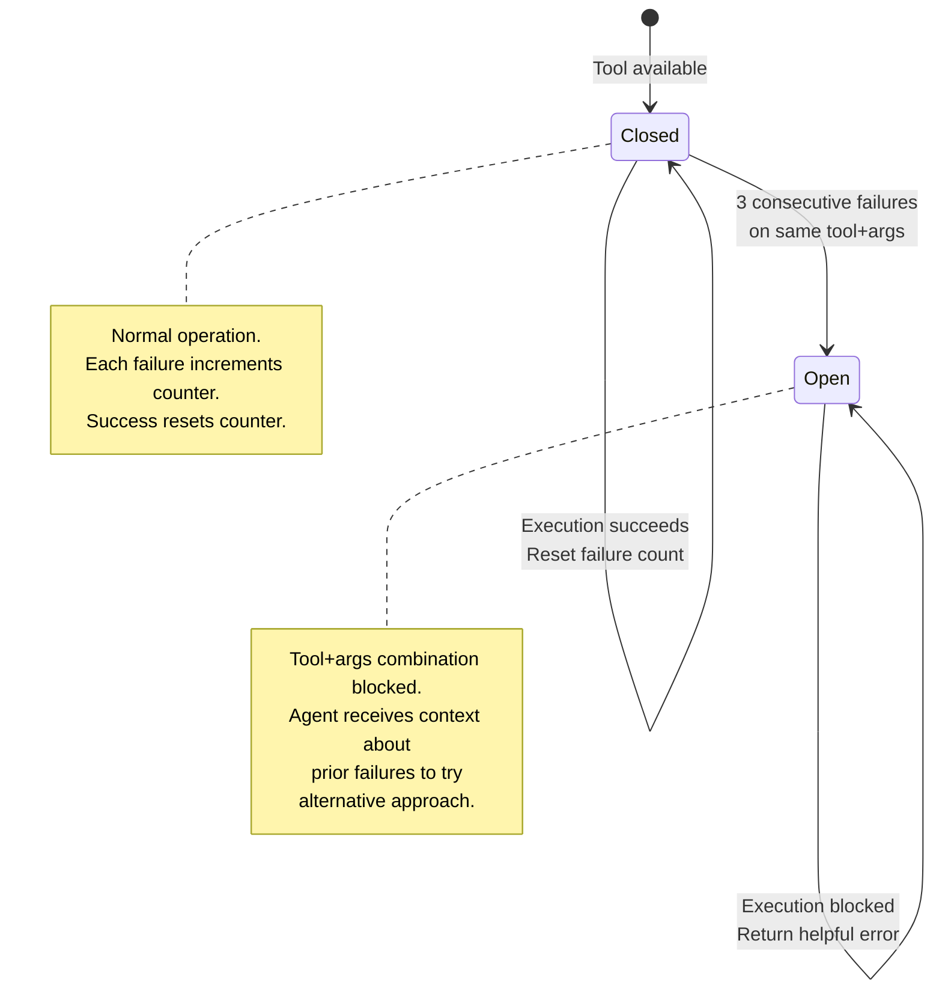

---

## Data Flow: Task Lifecycle

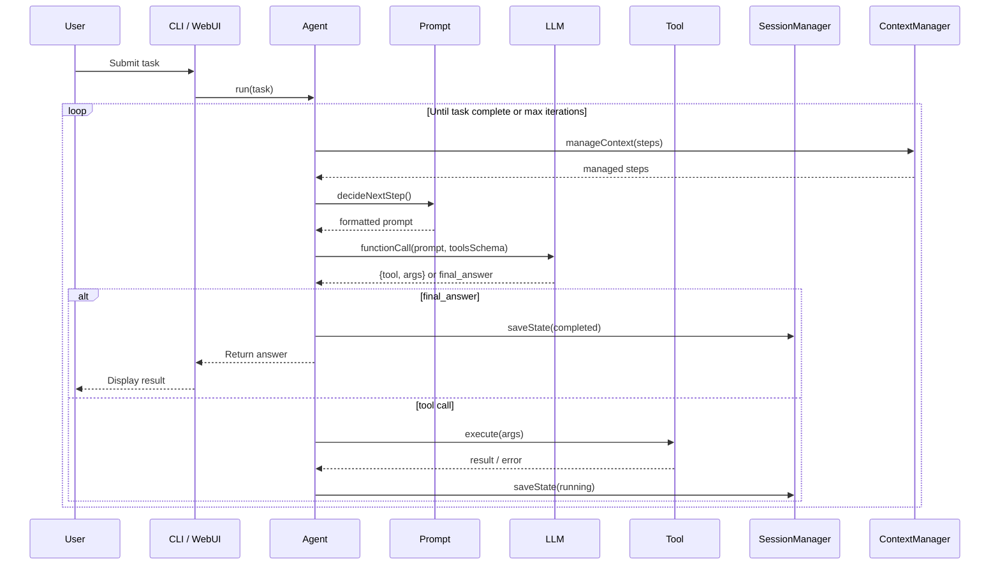
